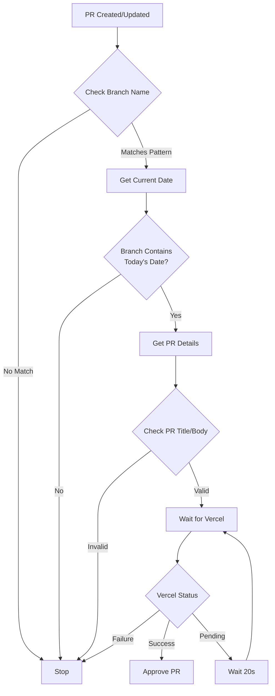

# Auto-approve Guild Events Update Workflow

This workflow automatically approves pull requests that update Discord guild events, but only if they meet specific criteria and pass all required checks.

## Overview

The workflow is designed to work in conjunction with the `update-guild-events.yml` workflow, providing automated approval for event update PRs that:
- Are created on the current date
- Have the correct branch name format (`update-events/YYYY-MM-DD`)
- Have passed Vercel deployment checks
- Contain the expected PR title and body

## Workflow Diagram

## Required Secrets

- `GH_PAT`: GitHub Personal Access Token with permissions to:
  - Read pull requests
  - Approve pull requests
  - Access check runs

## Workflow Steps

1. **Branch Name Validation**
   - Ensures PR branch follows pattern `update-events/YYYY-MM-DD`
   - Verifies date matches current date

2. **PR Content Validation**
   - Title must contain "Update events for [DATE]"
   - Body must be exactly "Automated PR to update Discord events"

3. **Vercel Deployment Check**
   - Polls Vercel deployment status every 20 seconds
   - Times out after 30 attempts (10 minutes)
   - Proceeds only on successful deployment

4. **Auto-approval**
   - Approves PR if all checks pass
   - Adds standard approval message

## Error Handling

- Workflow fails fast if any validation step fails
- Timeout after 10 minutes of waiting for Vercel deployment
- No approval if any conditions are not met

## Related Workflows

- [update-guild-events.yml](./update-guild-events.md) - Creates the PRs that this workflow approves