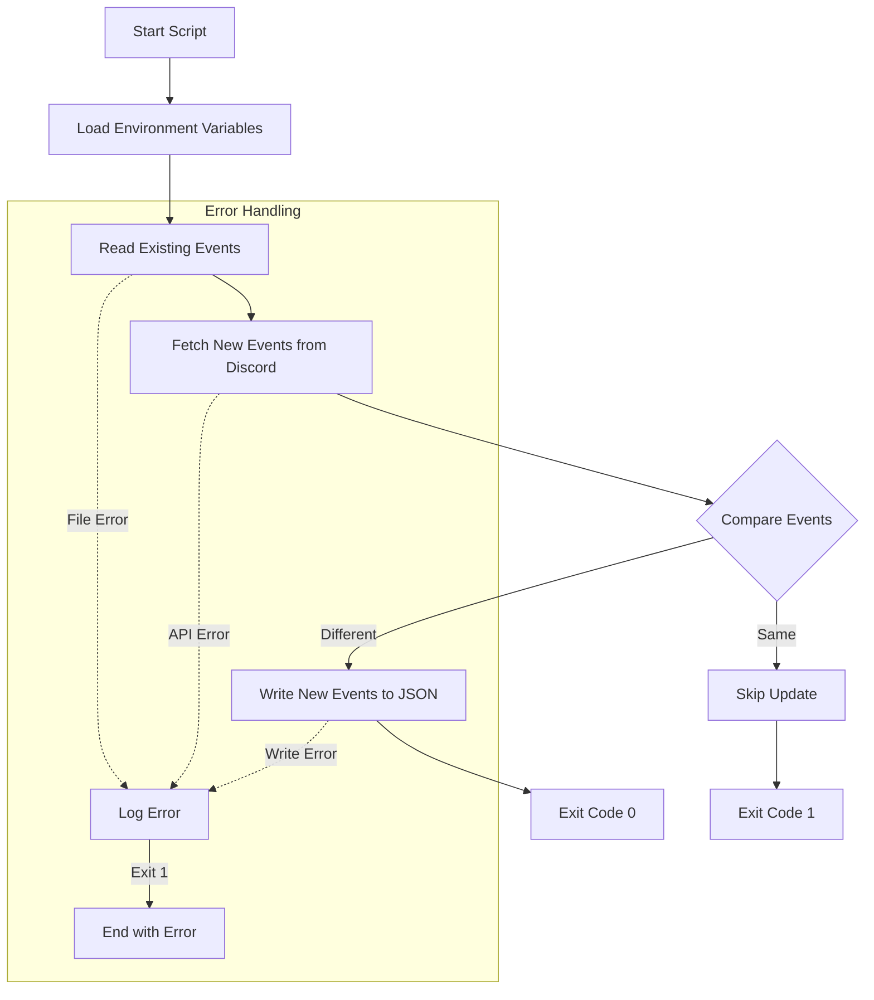
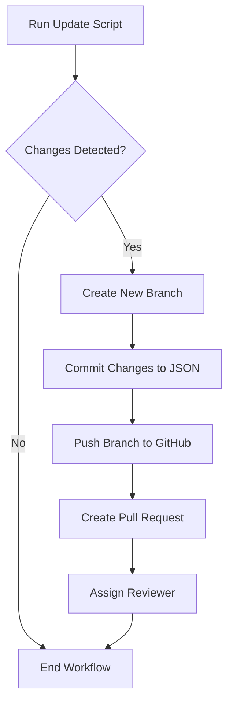

# Automating Lecture Updates with TS Node and GitHub Actions

## Overview
This system automatically fetches Discord guild scheduled events and updates them in the repository through GitHub Actions by:
- Running every weekday at 7 AM UTC
- Fetching latest Discord guild events
- Creating a new branch if changes are detected
- Opening a PR for review

## Implementation Details

### Update Script (`updateGuildEvents.tsx`)
The script handles fetching and updating Discord guild events:
- Fetches scheduled events from Discord API
- Compares with existing events using deep equality check
- Updates JSON file only if changes are detected
- Returns exit code 0 for changes, 1 for no changes

Key functions:
- `readEventsOnDisplay`: Reads and validates existing JSON file
- `fetchGuildScheduledEvents`: Fetches events from Discord API
- `compareEvents`: Deep comparison of old and new events
- `writeNewEvents`: Writes updated events to JSON file

### GitHub Action Workflow

The workflow is defined in `.github/workflows/update-guild-events.yml`:

## Requirements

- GitHub repository with Actions enabled
- Discord bot token with scheduled events permissions
- Discord guild ID
- GitHub PAT with repo access
- The following secrets configured:
  - `GH_PAT`: GitHub Personal Access Token
  - `GUILD_ID`: Discord Guild ID
  - `DISCORD_TOKEN`: Discord Bot Token

## Workflow Process

1. Runs automatically at 7 AM UTC on weekdays (or manual trigger)
2. Fetches latest Discord guild events
3. Compares with existing events
4. If changes detected:
   - Creates branch named `update-events/YYYY-MM-DD`
   - Commits updated JSON file
   - Creates PR and assigns to repository owner
5. If no changes: Workflow completes without modifications

## Troubleshooting

- Check Action logs for execution details and error messages
- Verify Discord bot permissions and token validity
- Ensure GitHub PAT has necessary repository permissions
- Check JSON file format in `site/app/public/future_events.json`